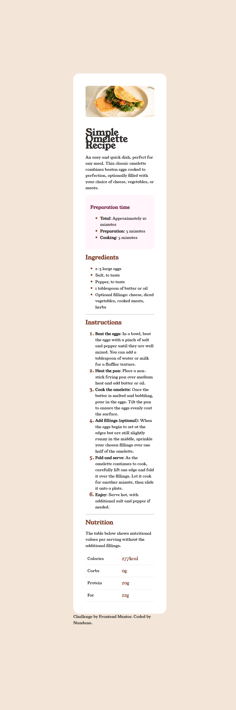

# Simple-Recipe
 This is a basic HTML and CSS webpage that displays a delicious recipe for a dish. It's a beginner-friendly project showcasing the use of structured HTML and styled with clean CSS.

## Features

- Displays a recipe with ingredients and instructions
- Styled using CSS for a clean layout
- Fully responsive on most screen sizes

## Preview

## Live Demo

Check out the live version here:
[https://ndn-dev579.github.io/Simple-Recipe/]

## How to Use

1. Clone or download this repository.
2. Open index.html in your browser to view the recipe page
